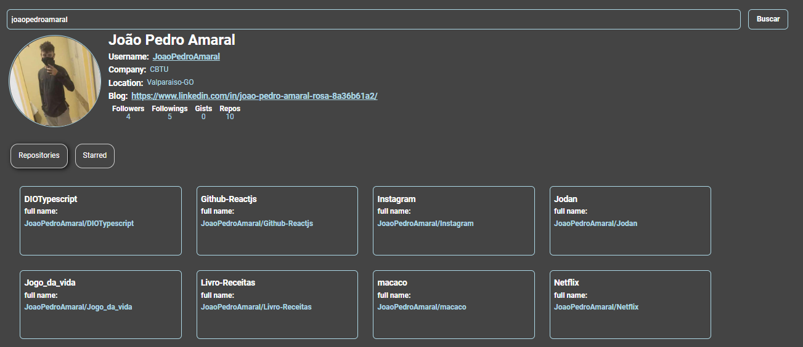

# Github - API

## About project
This repository was created in order to show how we can create a frontend application with reusable components.

We will create an application using the github public api.

## Features
- Search infos by username
- Search repo by username
- Search starred by username

## Preview
